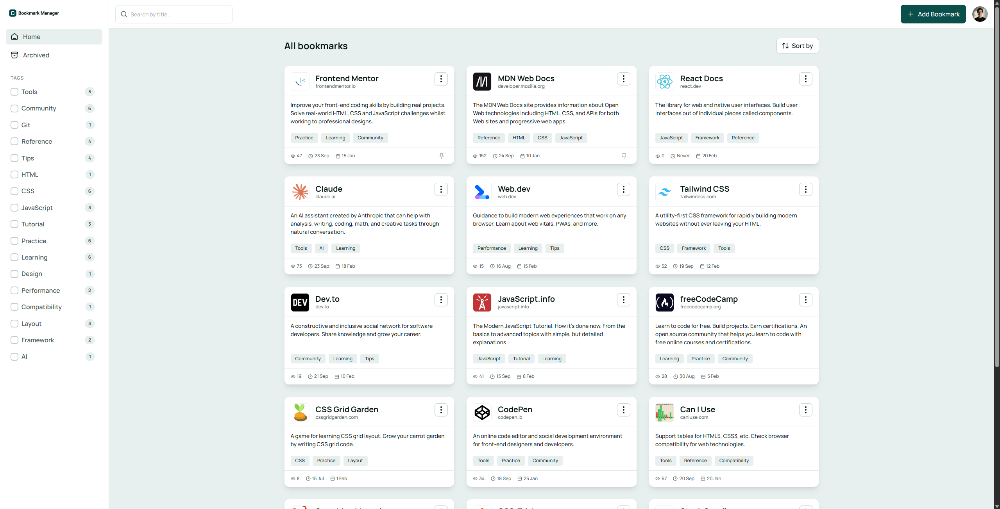
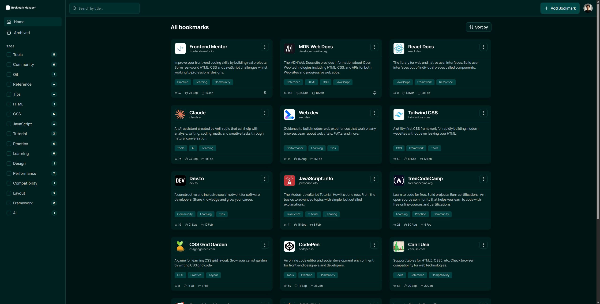

# 🔖 Frontend Mentor - Bookmark Manager App

A sophisticated, type-safe web application designed for efficient link organization. This project focuses on high-performance sorting, clean event handling, and a refined user experience with native dark mode support.

🚀 **Live Demo:** [View on Vercel](https://bookmark-manager-potwdub8d-pakuu7s-projects.vercel.app/)  
📂 **Source Code:** [GitHub Repository](https://github.com/Pakuu7/bookmark-manager-app)

---

## ✨ Key Features

* **📊 Dynamic Sorting System:** Toggle instantly between **Recently Added**, **Recently Visited**, and **Most Visited**. The UI updates in real-time, maintaining a strict descending order for visit counts.
* **🖱️ Smart UX (Click-Outside):** Custom-built event delegation that automatically closes menus, dropdowns, and modals when clicking outside the target element.
* **🌓 Native Dark Mode:** Full theme support with automatic persistence using `LocalStorage` for a consistent experience across sessions.
* **🗂️ Advanced Organization:**
    * **Pinning:** Keep essential links at the top of your list.
    * **Archiving:** Declutter your workspace without deleting your data.
    * **Tagging:** Categorize links for instant, tag-based filtering.
* **📱 Fully Responsive:** Optimized for a perfect experience on mobile, tablet, and desktop views.

---

## 📸 Project Showcase




---

## 🛠️ Tech Stack

| Technology | Purpose |
| :--- | :--- |
| **TypeScript** | Ensuring type-safety and robust application logic |
| **Tailwind CSS** | Modern styling with responsive utility classes and dark mode tokens |
| **Vite** | Fast frontend tooling and optimized build process |
| **LocalStorage** | Persistent data storage for bookmarks, visits, and theme settings |

---

## 🚀 Getting Started

To run this project locally, follow these steps:

### 1. Clone the repository

```bash
git clone https://github.com/Pakuu7/bookmark-manager-app.git 
```


### 2. Install dependencies
```bash 
npm install
```


### 3. Launch development server
```bash 
npm run dev
```

## 🏆 Credits
This project was developed as a solution to a [Frontend Mentor](https://www.frontendmentor.io/) challenge.
